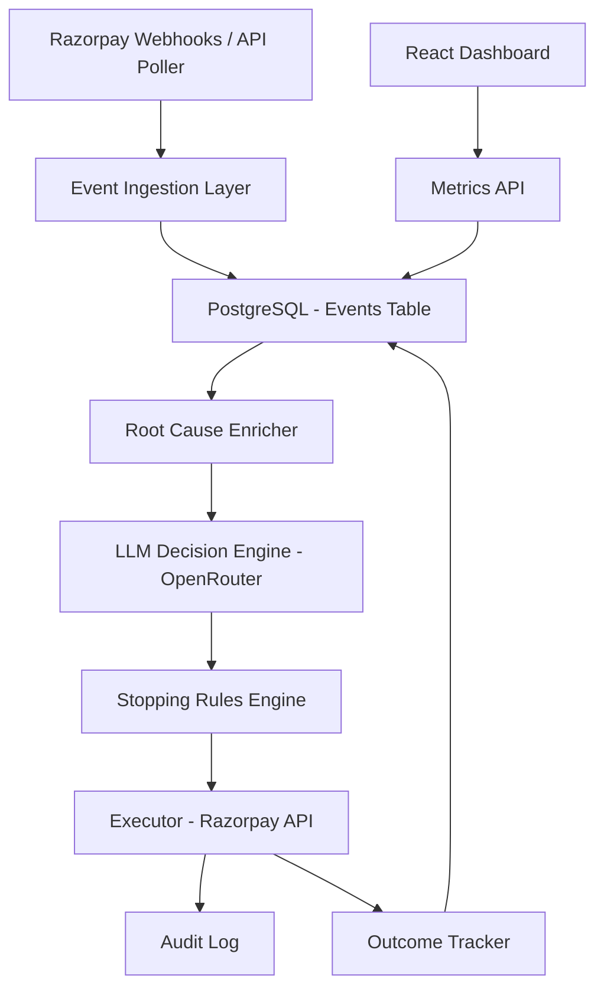

# RecoverIQ — AI Revenue Recovery Agent

## What is RecoverIQ
RecoverIQ is an autonomous agent that monitors a Razorpay account for signs of revenue leakage, detects and diagnoses loss events, selects and executes a bounded recovery intervention, and tracks outcomes with a full audit trail. The system couples automated decisioning with a React dashboard for observability and manual oversight.

## Architecture


## Tech Stack
| Component | Technology |
| --- | --- |
| Backend | Node.js, Express (ESM) |
| Frontend | React, Vite, TypeScript |
| Database | PostgreSQL (Prisma ORM) |
| LLM | OpenRouter (LLM decisioning) |
| Payments | Razorpay API / Webhooks |

## Setup

### Prerequisites
- Node.js 18+
- Docker
- Razorpay test account
- OpenRouter API key

### Installation
1. Clone repo
2. cd recoveriq && npm install
3. cd frontend && npm install
4. Run PostgreSQL locally:
   ```bash
   docker run -d \
     --name recoveriq-db \
     -e POSTGRES_USER=recoveriq \
     -e POSTGRES_PASSWORD=recoveriq_dev \
     -e POSTGRES_DB=recoveriq \
     -p 5432:5432 \
     -v recoveriq_pgdata:/var/lib/postgresql/data \
     postgres:16-alpine
   ```
5. cp .env.example .env and fill values
6. npx prisma migrate dev
7. npx prisma db seed
8. npm run dev (backend on 3000)
9. cd frontend && npm run dev (frontend on 5173)

## Environment Variables
| Variable | Description |
| --- | --- |
| DATABASE_URL | Postgres connection string used by Prisma |
| RAZORPAY_KEY_ID | Razorpay API key id for the merchant/test account |
| RAZORPAY_KEY_SECRET | Razorpay API key secret |
| OPENROUTER_API_KEY | API key for OpenRouter (LLM requests) |

## How the Agent Works
1. Detect
   - The ingestion layer receives Razorpay webhooks and performs periodic polling to surface failed payments and other anomalies.
2. Diagnose
   - A root-cause enricher aggregates payment metadata, customer history, and heuristics to produce a likely cause for the event.
3. Decide
   - The LLM Decision Engine (via OpenRouter) recommends a bounded intervention (or escalation) according to policy and stopping rules.
4. Execute
   - The Executor carries out the chosen intervention using the Razorpay API (e.g., create payment link, retry capture, send dunning message), with each planned action written to the audit log before execution.
5. Track
   - The Outcome Tracker observes subsequent events and marks recovery success/failure, updating the event record and emitting metrics.

## API Endpoints
| Method | Path | Description |
| --- | --- | --- |
| GET | /health | Health check |
| GET | /metrics | Prometheus-style metrics for observability |
| GET | /dashboard | Dashboard API (aggregates) |
| GET | /events | List events (filters by status/type) |
| GET | /events/:id | Get event detail, interventions and audit logs |
| POST | /webhook/razorpay | Receive Razorpay webhooks |
| POST | /agent/run/:eventId | Run agent on a single event (sync) |
| POST | /agent/run-batch | Run agent over a batch of pending events (returns final JSON) |
| POST | /agent/run-batch-stream | Run agent over a batch and stream results via SSE (per-event streaming) |
| POST | /agent/track-outcomes | Manual trigger to re-run outcome tracking (internal use) |

## Recovery Classes Handled
- Payment Failed — attempt retries, create payment link or capture retry depending on root cause.
- Order Abandoned — send payment link and a short recovery flow; fall back to dunning if unresponsive.
- Mandate Failed — notify customer and retry mandate setup or escalate to manual follow-up.

## Intervention Types
| Type | When used | Reversibility |
| --- | --- | --- |
| PAYMENT_LINK | When direct retry is not possible or when creating a new payment is required | Reversible (link can be revoked; outcome non-destructive) |
| RETRY | Automated retry of capture or API operation when transient errors are detected | Partially reversible (may be retried or rolled back depending on payment state) |
| DUNNING_MESSAGE | Customer-facing reminder or nudge for failed payments | Non-destructive; reversible in the sense messaging can stop or be repeated |
| ESCALATE | Used when root cause is unknown or policy requires human review | Not reversible — requires manual resolution and audit trail |

## Stopping Rules
- Maximum retries: 3 attempts per event
- Cooldown: 24 hour cooldown between automated attempts for the same event
- Opt-out flag: customers/events may be flagged to opt-out of automated recovery
- ESCALATE on unknown root cause or when safety thresholds are exceeded

## Honest Metrics
This project tracks recovery metrics rather than attempting to report precision/recall for open-ended LLM outputs. Key metrics include recovery rate, intervention success rate per type, and false escalation rate (cases where unknown root cause led to ESCALATE). Note: historical data shows 194 escalations due to unclassified root causes — this is a known limitation and an area for future improvement.

## Audit Trail
RecoverIQ follows an audit-first pattern: every planned action is written to the database as an `AuditLog` entry before execution. Each intervention stores a `reversalPayload` where applicable so human operators can review and, if required, reverse or annotate actions.

## License
This project is licensed under the [MIT License](LICENSE.md).
